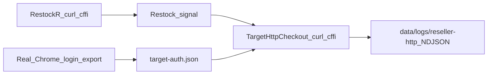

# PokeBot Architecture (Target HTTP)

Current design: RestockR signals → Target checkout over **`curl_cffi`** using cookies exported from **real Chrome**. No Playwright, no Walmart browser queues, no PX harvest browser.

## Auth

- `pokebot login target` launches system Chrome (or attaches via CDP) and writes `data/sessions/target-auth.json`.
- Sidecar must include registered auth (`accessToken`, `idToken`, ideally `sut=R`) **and** PerimeterX `_px3` (plus `_pxvid` / `_pxhd` / `pxcts` when present). `login-session` is optional/legacy.
- Checkout fails fast if auth or `_px3` is missing — refresh with `login target`.

## Money path

- Capture file: `config/reseller.capture.target.json` (templated ATC → checkout chain).
- Client: `src/pokebot/reseller/checkout/target_http.py` replays the capture with pinned `reseller.curl_impersonate`.
- ATC circuit breaker: abort after sustained `401 AUTH_DENIED` or `429` (see `config/reseller.yaml`).
- Preflight (`reseller target --preflight`) runs live up to — but not including — `commits_order` requests.

## Telemetry

Every outbound Target request dumps a redacted NDJSON line under `data/logs/reseller-http/` (`http_telemetry.py`): impersonate target, proxy host, headers (values redacted), transport fields, curl timing infos when available, status/body snip.

## CLI

| Command | Role |
|---------|------|
| `login restockr` / `login target` | RestockR token; Chrome cookie export |
| `doctor` | Arch + RestockR + sidecar completeness |
| `reseller run` / `reseller target` | HTTP buy (live / `--preflight`) |
| `open-alerts` | Listen and open URLs in everyday Chrome only |
| `status` | Watchlist / session summary |

See [AGENTS.md](../AGENTS.md) for agent-oriented operating notes.
